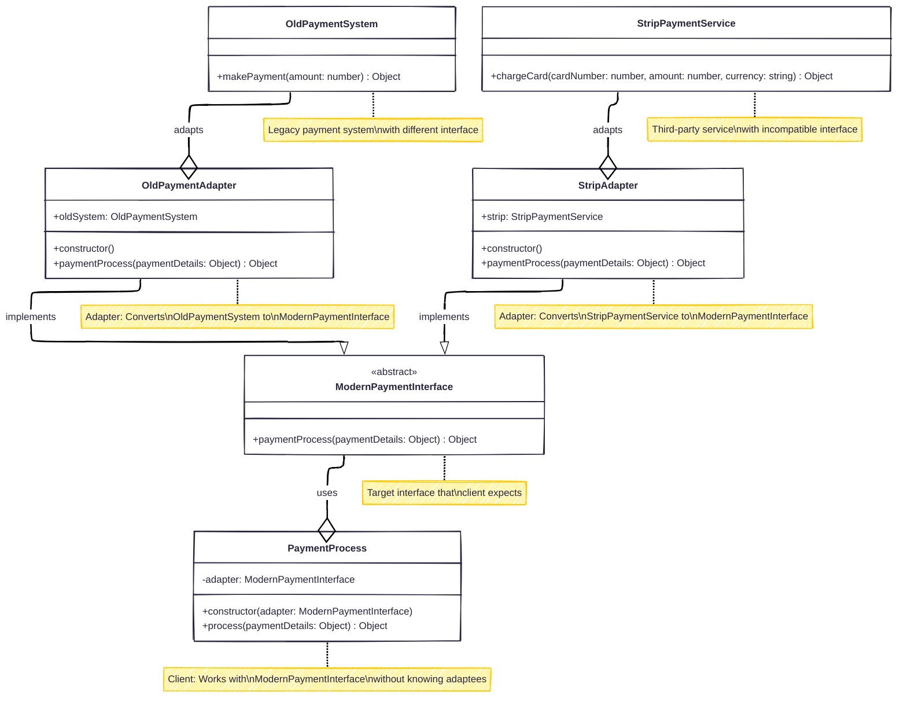

# Structural Design Pattern : 

> Patterns that deal with object composition and identify simple ways have relationships between different objects

## decorator 
//attach new behaviors or responsibilities to objects without modifying their structure. just adding wraper class to the original class and providing new functionalities

```typescript
class coffee{
    constructor(){
        this.desc="this is basic coffee";
        this.cost=0;
    }
    cost(){
        return this.price+5;
    }
}
class SuggarCoffee extends coffee{
    constructor(basic){
        supper()
        this.basic=basic;
    }
    const(){
        return this.basic()+45; 
    }
}
class ChocolateCoffee extends coffee{
    constructor(basic){
        this.basic=basic;
    }
    cost(){
        return this.basic.cost()+10;
    }
}
const basic=new coffee();
const suggar=new SuggarCofffee(basic);
const choco=new ChocolateCoffee(basic);
```
## Adapter
 - **Allows objects with incompatible interfaces to work together by wrapping an object with an interface that the client expects.**

